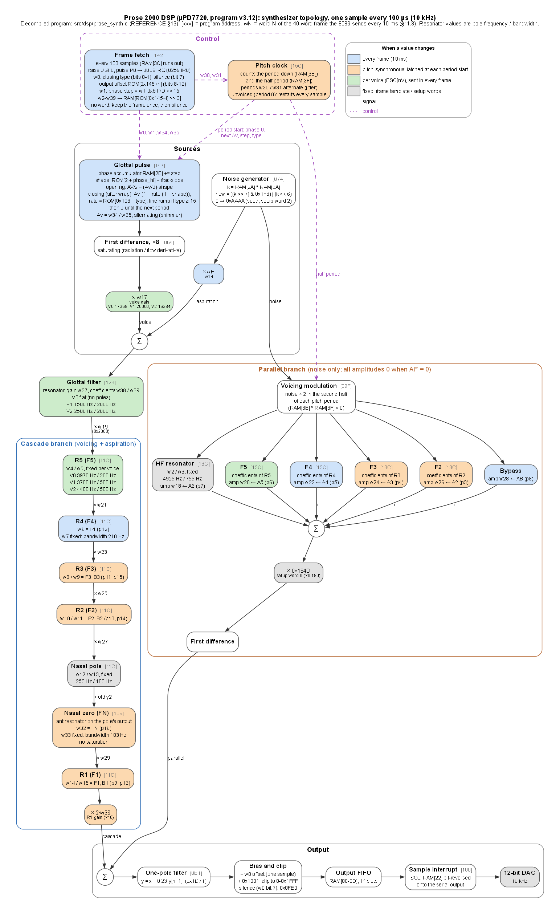

# DSP graphs

`synth_topology.png` (and `.svg`, `.dot`) is the signal flow of the µPD7720 program (DSP v3.12), drawn from its
decompilation [`src/dsp/prose_synth.c`](../src/dsp/prose_synth.c) (REFERENCE.md §13). `make_graph.py` writes the
Graphviz source and renders it (`python dsp_graphs/make_graph.py`, needs `dot` on `PATH`). It decodes the fixed
resonators from the ROM data in `src/data/prose_data.c`, so their frequencies and bandwidths are computed, not typed in.

## Reading the graph

- **Boxes** are stages of the one-sample loop. `[xxx]` is the program address of the code (§13.1). `wN` is word *N*
  of the 40-word frame the 8086 sends every 10 ms (§11.3), and `pN` is the parameter track it comes from (§11.4).
- **Colour** shows when a value changes. Blue: with every frame. Orange: pitch-synchronously. The pitch clock copies
  the pending F1-F3 and FN coefficients and gains to their working slots only at the start of a pitch period (every
  other sample when unvoiced). Green: per voice (sent in every frame, but set by `ESC[nV`). Grey: fixed, from the frame
  template `DS:5656` or the setup words `DS:5646`.
- **Solid arrows** carry the signal and **dashed purple arrows** carry control. A label `× wN` on a cascade arrow is a
  gain: each resonator's normalising gain is applied at the input of the next stage.
- **Resonator values** are pole frequency / bandwidth at 10 kHz, from a = r·cos θ and b = r² (Q15).

## What it shows

- **Klatt-style cascade/parallel design.** The voice source and the aspiration go through the cascade. Only noise
  drives the parallel branch, and its amplitudes are zero unless AF > 0.
- **The cascade runs from high to low**: F5, F4, F3, F2, then a fixed nasal pole (253 Hz), the nasal zero (FN), and F1
  last. F5 is a fixed resonator per voice. F4 has a fixed bandwidth (210 Hz).
- **The parallel resonators share their coefficients with the cascade** (F5, F4, F3, F2) but keep their own state.
  They add a fixed 4.9 kHz resonator and a bypass path. The amplitudes alternate in sign, then the sum is scaled and
  differentiated.
- **The glottal filter** is a single resonator after the source. Voice 0 has no poles there (gain only). Voices 1 and
  2 have a very broad resonance (2 kHz bandwidth) at 1.5 and 2.5 kHz.
- **The output** passes through a one-pole filter (y = x − 0.23·y[n−1]). It is then biased to 13 bits, clipped,
  buffered in a 14-slot FIFO, and shifted out bit-reversed on the serial port to the DAC.
